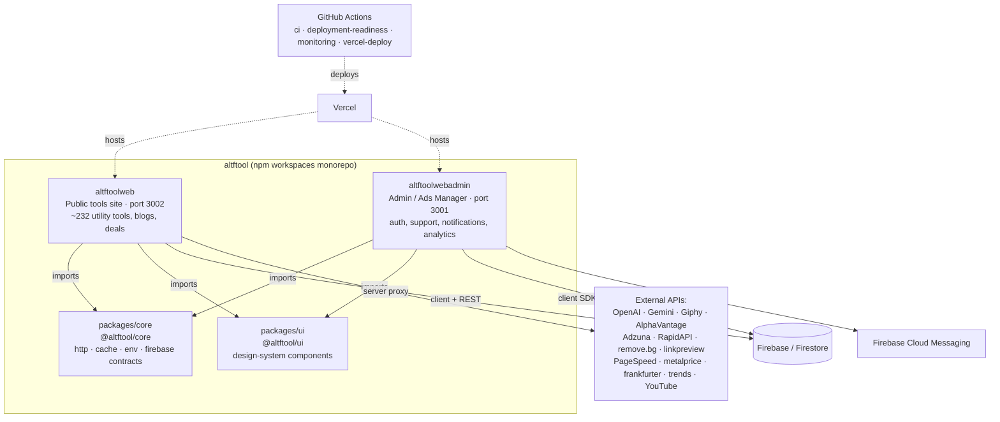
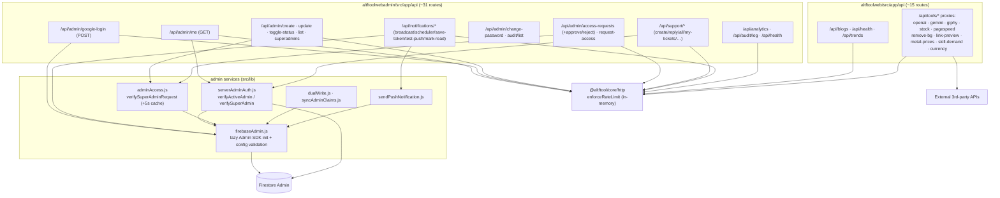
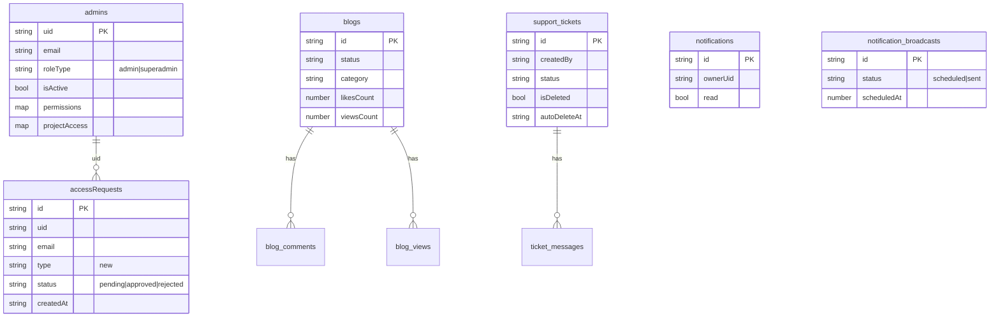
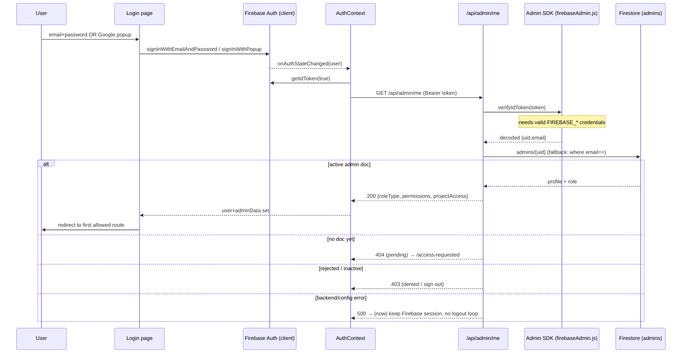
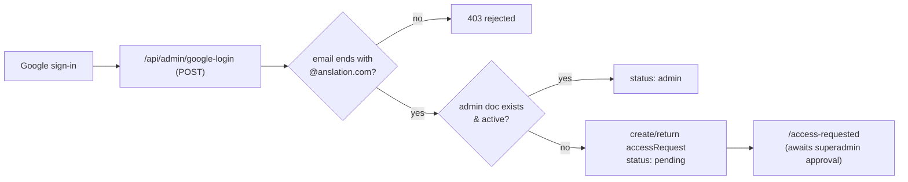
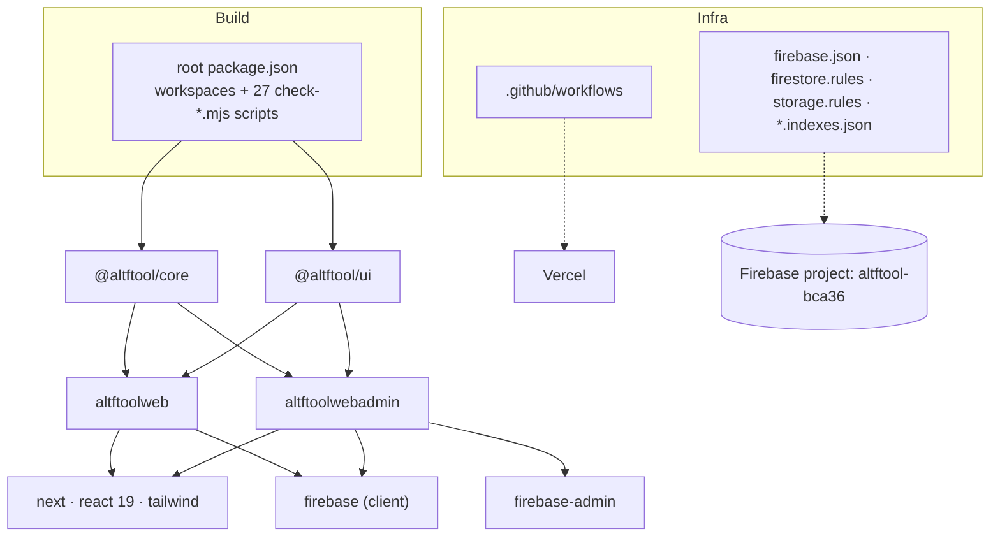
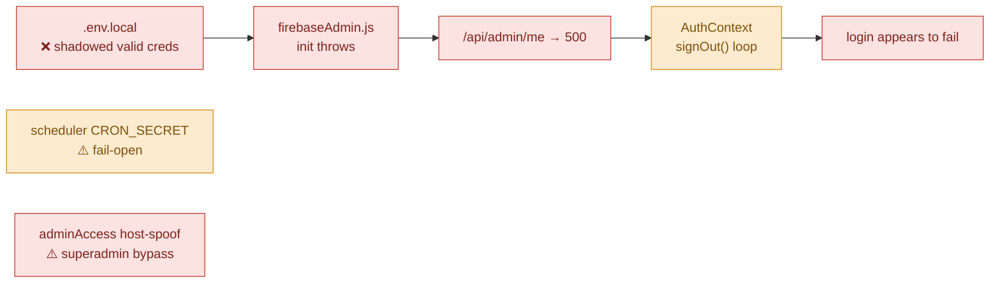

# AltFTool — Architecture Code Map (Graphify-style)

> Generated 2026-06-17. A visual map of the monorepo: frontend, backend, database, authentication flow, APIs, services, and dependencies. Diagrams use Mermaid — view in any Mermaid-capable Markdown renderer (GitHub, VS Code Mermaid preview, etc.).

---

## 1. System context (monorepo at a glance)

The repo is an **npm workspaces monorepo** with two Next.js apps and two shared packages.



| Workspace | Role | Auth? | Runtime |
|-----------|------|-------|---------|
| `altftoolweb` | Public, read-only tools catalog + content | No user auth | Next.js App Router (SSR/ISR) |
| `altftoolwebadmin` | Internal admin console | Firebase Auth + Firestore RBAC | Next.js App Router |
| `packages/core` | Shared runtime helpers | n/a | ESM library |
| `packages/ui` | Shared React design system | n/a | React 19 library |

---

## 2. Frontend architecture

```mermaid
flowchart LR
    subgraph AdminFE["altftoolwebadmin — frontend"]
        LP["/login (page.jsx)"]
        AC["AuthContext.jsx<br/>(onAuthStateChanged, /api/admin/me)"]
        PROT["(protected) route group<br/>AdminLayout"]
        MODS["module routes:<br/>admin-management · analytics · health<br/>support · tickets · notifications · profile · [project]"]
        LIB["lib/: firebase.js · apiClient.js<br/>permissionUtils · usePushNotifications"]
    end

    subgraph WebFE["altftoolweb — frontend"]
        SLUG["[slug] dynamic tool pages"]
        TOOLS["src/tools/* (~232 tools)"]
        PLAT["src/platform/*<br/>analytics · navigation · seo · registry · chatbot"]
        CTX["contexts: ThemeContext · GlobalAnimationProvider"]
        WLIB["lib/: firebase.js · firebaseCache.js"]
    end

    LP --> AC --> PROT --> MODS
    AC --> LIB
    SLUG --> TOOLS --> PLAT
    SLUG --> CTX
    PLAT --> WLIB

    AdminFE -->|@altftool/ui| UIPKG[(Design system)]
    WebFE -->|@altftool/ui| UIPKG
```

- **Framework:** Next.js App Router, React 19, Tailwind CSS.
- **Shared UI:** `@altftool/ui` (Button, Input, Card, Modal, Toast, Badge, …).
- **Admin state:** `AuthContext` is the single source of truth for the signed-in admin; pages render inside the `(protected)` route group.
- **Web app:** registry-driven — `src/tools/*` tool definitions are mapped to dynamic `[slug]` routes; mostly static/ISR with client interactivity.

---

## 3. Backend architecture (API routes & services)



- **Pattern:** Next.js Route Handlers (serverless functions), one folder per endpoint.
- **Admin SDK:** `firebaseAdmin.js` lazily initializes `firebase-admin` via a proxy, validating credentials from `FIREBASE_SERVICE_ACCOUNT`, a service-account file, or split `FIREBASE_*` env vars.
- **Authorization helpers:** `serverAdminAuth.js` (token → `admins` doc → active check) and `adminAccess.js` (`verifySuperAdminRequest`, with a 5s read cache).
- **Web API:** thin server-side **proxies** that keep third-party API keys off the client and apply rate limiting.

---

## 4. Database model (Firestore)



Other collections governed by `firestore.rules`: `projects/{projectId}/**`, `pintrest`, `pintrest_categories`, `results`. Rules are **default-deny** with field-level constraints on public writes (counters, comments, view pings). Composite indexes are defined in `firestore.indexes.json`; storage governed by `storage.rules` (MIME allowlist + size caps).

---

## 5. Authentication & authorization flow (UI → DB)

This is the path that was failing. It is now restored.





**Key facts:**
- There is **no public self-signup**. "Signup" = the **request-access** flow: a new Google user is auto-recorded as a *pending* `accessRequest`, which a superadmin approves to create the `admins` doc.
- **Authentication** = Firebase Auth (email/password or Google, domain-restricted).
- **Authorization** = Firestore `admins` doc (`roleType`, `isActive`, `permissions`, `projectAccess`) + Firebase custom claims (`syncAdminClaims.js`).
- Server trust boundary = Admin SDK `verifyIdToken` on every API call. **If the Admin SDK can't initialize, the entire auth chain fails closed at `/api/admin/me`.** ← this was the outage.

---

## 6. Dependency & build topology



- **Shared deps flow one way:** `core`/`ui` → apps. No app-to-app imports.
- **Validation tooling:** root has ~27 `scripts/check-*.mjs` gates (env readiness, route QA, Firebase contracts/integrity, performance budgets, deploy readiness) wired into CI.
- **CI/CD:** `ci.yml` (build/test/security/lighthouse + Firebase emulator) → `vercel-deploy.yml`; `monitoring.yml` runs hourly production health checks.

---

## 7. Where the failure lived (heat map)



See `BACKEND_AUTH_AUDIT_REPORT.md` for root-cause detail, the fixes applied, and the prioritized improvement roadmap.
