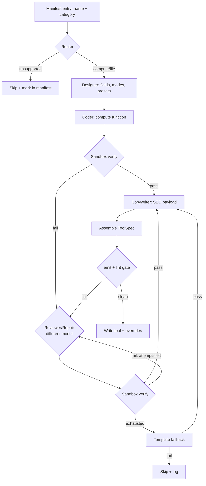

# Multi-Agent Tool Factory — Architecture

A free-only, multi-agent pipeline that builds correct tools by **decomposing**
"make a tool" into specialised sub-tasks, giving each to the free model best
suited to it, and gating everything through the **deterministic sandbox** we
already have.

Core principle: **models are imperfect and free — the sandbox is the source of
truth.** No LLM output ships until it passes validation. Model diversity +
a validation-gated repair loop turns several mediocre free models into one
reliable factory.

---

## 1. Why multi-agent (what we learned)

A single 7B model producing a whole tool in one shot gave ~50% broken output
(key mismatches, fake logic, wrong algorithms, shallow UX). Building a tool is
really **five different jobs**, each needing a different strength:

| Job | Needs | Bad single-model outcome we saw |
|-----|-------|---------------------------------|
| Decide if it's buildable | judgement | built fake "audio-to-text" |
| Design inputs/UX | product sense + strict JSON | leaked "Basic" labels, missing fields |
| Write the logic | strong code | `btoa` for Base32, key mismatches → NaN |
| Write copy/SEO | fluent prose | n/a (low stakes) |
| Fix what's broken | debugging + different perspective | same model repeats its own bug |

So: **one agent per job, each on the free API that's best at that job.**

---

## 2. The agents

Every agent implements one interface so the orchestrator is provider-agnostic:

```
class Agent {
  role            // "router" | "designer" | "coder" | "reviewer" | "writer"
  providers[]     // ordered free providers to try (failover)
  async run(input, { schema }) -> validated JSON | text
}
```

| # | Agent | Job | Output | Best free model (primary → fallback) | Why |
|---|-------|-----|--------|--------------------------------------|-----|
| 0 | **Router / Classifier** | Is this `compute` / `file` / `unsupported`? | `{kind, reason}` | **rules first** (our `capability.mjs`) → Gemini Flash tiebreak | mostly deterministic; LLM only for edge cases |
| 1 | **Spec Designer** | Design fields, types, modes, presets, defaults from the tool name | ToolSpec *without* compute | **Gemini 2.x Flash** → Groq Llama-70B | strong structured-JSON + product reasoning, generous free tier |
| 2 | **Logic Coder** | Write the pure `compute(values,mode)` function | compute string | **Groq (Qwen2.5-Coder / Llama-70B)** → Mistral Codestral → Cerebras | code-specialised + very fast (enables multiple attempts) |
| 3 | **Reviewer / Repair** | Given sandbox errors, fix compute — must be a *different* model than the coder | compute string | **OpenRouter DeepSeek (free)** → GitHub Models GPT-4o-mini → Gemini | cross-model diversity catches the coder's blind spots |
| 4 | **Copywriter** | intro / use-cases / benefits / FAQs | SEO payload | **local Ollama** → Groq Llama-8B | low stakes, high volume → keep it local/free-fast |
| — | **Verifier** | Prove it works | pass/fail + samples | **deterministic sandbox** (no LLM) | the hard gate; already built (`lib/sandbox.mjs`) |

Key move: **the Coder and the Reviewer are always different models.** A model
rarely spots the bug it just wrote; a second model with a different training
distribution does.

---

## 3. Free provider pool

Each provider is a thin adapter reading its key from env, exposing
`chat(messages, {json, schema})`. Providers are pooled and rotated to stay
inside free rate limits.

| Provider | Free tier (approx) | Strength | Env |
|----------|--------------------|----------|-----|
| **Google Gemini** | ~15 RPM, ~1.5k/day (Flash), JSON schema mode | design, reasoning, JSON | `GEMINI_API_KEY` |
| **Groq** | ~30 RPM, blazing fast, Llama-3.3-70B / Qwen-coder | fast code + reviews | `GROQ_API_KEY` |
| **OpenRouter** | `:free` models (DeepSeek, Llama), daily cap | second-opinion repair | `OPENROUTER_API_KEY` |
| **Mistral** | free Codestral tier | code | `MISTRAL_API_KEY` |
| **Cerebras** | free, extremely fast Llama | high-throughput code | `CEREBRAS_API_KEY` |
| **GitHub Models** | free dev tier (GPT-4o-mini, o-mini) | strong reasoning | `GITHUB_TOKEN` |
| **Cloudflare Workers AI** | free daily neurons | utility/bulk | `CF_*` |
| **Ollama (local)** | unlimited, offline | fallback + copy + bulk | — |

**Rate-limit strategy (`ProviderPool`):**
- Round-robin across configured keys/providers for a role.
- On `429`/timeout → mark provider cooling-down, fail over to the next in the
  role's list; exponential backoff; the **local Ollama is always the last
  resort** so the pipeline never fully stalls.
- A token/RPM budgeter per provider keeps usage inside free quotas; excess work
  queues instead of erroring.

---

## 4. Orchestration flow (per tool)



Rules that make free models reliable:
- **Verify after every generation and every repair.** The sandbox runs compute
  on default + preset + variant + edge inputs; rejects NaN/undefined/empty,
  missing-key refs, fake strings, and banned capabilities (already implemented).
- **Repair loop, bounded** (e.g. 3 attempts), each attempt using the Reviewer
  model with the *exact* error message + failing inputs.
- **Template fallback** for the handful nothing fixes → deterministic, always valid.
- **Skip, never fake.** Anything still failing stays `pending`; nothing broken ships.

---

## 5. How it slots into what exists (zero rewrite)

The whole thing is **one new `ToolGenerator` implementation** — the rest of the
pipeline (`build-batch`, `ToolSpec`, `sandbox`, `ToolRuntime`, manifest, lint
gate, checkpointing) is unchanged.

```
automation/
  generator/
    ToolGenerator.mjs          # existing interface (unchanged)
    OllamaToolGenerator.mjs     # existing single-model
    TemplateToolGenerator.mjs   # existing deterministic fallback
    AgenticToolGenerator.mjs    # NEW — orchestrates the agents below
    agents/
      Router.mjs                # role 0
      Designer.mjs              # role 1
      Coder.mjs                 # role 2
      Reviewer.mjs              # role 3
      Writer.mjs                # role 4
    providers/
      ProviderPool.mjs          # rotation, failover, rate-limit budgeter
      gemini.mjs  groq.mjs  openrouter.mjs  mistral.mjs
      cerebras.mjs  githubModels.mjs  ollama.mjs
    validate.mjs                # existing sandbox gate (reused as Verifier)
  config/
    agents.json                 # role → ordered provider list (below)
```

`AgenticToolGenerator.generate(entry)` implements the flow in §4 and returns a
raw ToolSpec — exactly what `build-batch` already expects. Selecting it:

```
TOOLGEN=agentic node automation/build-batch.mjs --count 50
```

`createGenerator()` gains one branch: `agentic → new AgenticToolGenerator(config)`.

### config/agents.json (example)
```json
{
  "router":   { "providers": ["rules", "gemini"] },
  "designer": { "providers": ["gemini", "groq", "ollama"] },
  "coder":    { "providers": ["groq", "mistral", "cerebras", "ollama"] },
  "reviewer": { "providers": ["openrouter", "githubModels", "gemini"] },
  "writer":   { "providers": ["ollama", "groq"] },
  "repairAttempts": 3
}
```
Add a key to `.env`, add the provider to a role's list — no code change.

---

## 6. Reliability model (why free ≈ correct here)

Correctness does **not** depend on any single model being good. It comes from:
1. **Decomposition** — each model does only what it's best at.
2. **Model diversity** — coder ≠ reviewer, so blind spots don't compound.
3. **Deterministic verification** — the sandbox is the judge, not an LLM.
4. **Bounded repair + template fallback + skip** — a bad tool is fixed, replaced,
   or dropped; it is never shipped.
5. **Provider failover** — one API being rate-limited never stops the line.

Expected effect vs the single-7B baseline (~50% good): correctness rises toward
the sandbox's guarantee (only tools that *provably* run and use their inputs get
written), while throughput is governed by the slowest free rate limit — mitigated
by rotation and the always-available local fallback.

---

## 7. Build order (phased)

1. **ProviderPool + 2 adapters** (Gemini, Groq) with rate-limit failover; unit-test against the free tiers.
2. **Coder + Reviewer + Verifier loop** only (Designer stubbed to a fixed field template) — proves the validation-gated repair loop end-to-end.
3. **Designer agent** (Gemini structured output) → real field/UX design.
4. **Writer agent** (Ollama) for SEO payload.
5. **Router** = existing rules + optional LLM tiebreak.
6. Wire `AgenticToolGenerator` into `createGenerator()`; run a 50-tool batch; compare audit pass-rate vs single-model.
7. Add more providers to the pools (OpenRouter, Mistral, Cerebras, GitHub Models) as free keys are obtained.

Everything runs behind the existing checkpointing/resume, so batches stay
crash-safe. Nothing here touches git.
```
