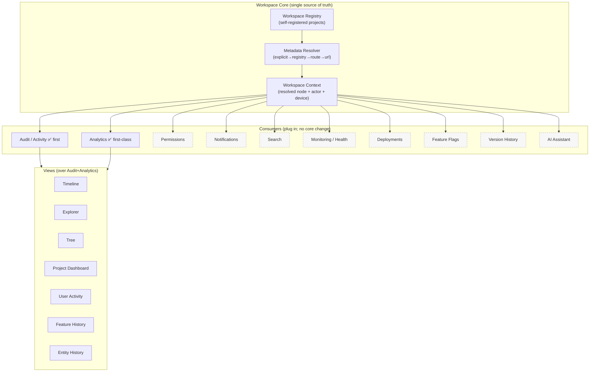
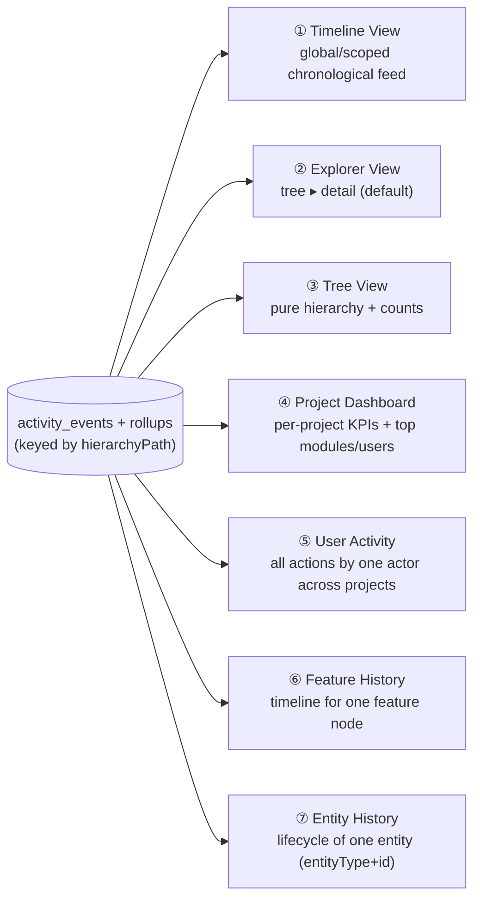

# Workspace Management System — Architecture (v2)

> Status: **DESIGN v2 — awaiting implementation approval. No code written.**
>
> **Paradigm:** This is no longer "an audit system." It is a **registry-first
> Workspace platform**. A single **Workspace Registry** is the source of truth for
> the hierarchy **Workspace → Project → Application → Module → Section → Feature →
> Activity**. Many subsystems *consume* that hierarchy; **Audit/Activity is simply
> the first consumer**. Analytics, Permissions, Notifications, Search, Monitoring,
> Deployments, Feature Flags, Version History, AI Assistant, Error Tracking, API
> Usage all plug into the same registry later **without redesign**.
>
> Comparable to how GitHub Enterprise, Jira, Linear, Vercel, and Azure DevOps model
> an org/workspace once and let every feature hang off it.

---

## 0. What changed from v1 (per review)
| # | Refinement | Reflected in |
|---|---|---|
| 1 | Workspace platform, audit is one consumer | §1, §2, §5 |
| 2 | Resolution priority: **explicit → registry → route → URL** | §4 |
| 3 | Dynamic **self-registration**, auto-discovery, ~zero-change onboarding | §3 |
| 4 | **Multiple views** (Timeline/Explorer/Tree/Project Dashboard/User/Feature/Entity) | §10 |
| 5 | **First-class analytics** across every hierarchy level | §11 |
| 6 | **Plug-in consumers** for future systems, no redesign | §2, §5, §17 |
| 7 | **Zero-downtime** migration, old logs + `logAuditEvent()` keep working | §13 |
| 8 | **6-phase** implementation, each compiles + backward compatible | §18 |

---

## 1. The canonical Workspace hierarchy
```
Workspace ("anslation")
└─ Project        (altftool, leadtree, myluckydeal, anternet, knowleaplogy, …)
   └─ Application (admin-panel, public-website, mobile, api, …)
      └─ Module   (tools, blogs, ads, seo, analytics, …)
         └─ Section  (ai-tools, pdf-tools, image-tools, …)   ← optional
            └─ Feature (image-optimizer, qr-generator, …)    ← optional
               └─ Activity (an event produced by any consumer)
```
**Node identity = `hierarchyPath`**, a stable slug chain:
`altftool/admin-panel/tools/image-tools/image-optimizer`.
Every consumer references nodes by this path — the universal join key across the
whole platform.

## 2. Layered architecture (registry core, plug-in consumers)

The **registry + resolver + context** are the only things a new consumer needs.
Audit and Analytics ship now; the dashed boxes are future consumers that attach
the same way.

## 3. Workspace Registry — dynamic self-registration (single source of truth)
No giant hand-maintained central file. **Each project registers itself**; the
Workspace Manager auto-discovers all registrations at boot.

```
src/lib/workspace/
  registry.js          # Workspace Manager: register(), getProject(), getNode(), tree()
  types.js             # node typedefs + consumer-metadata slots
  discover.js          # auto-imports every projects/*/*.workspace.js + fallback gen
  resolve.js           # §4 priority resolver
  context.js           # buildWorkspaceContext(input) → resolved node + actor + device
src/projects/altftool/altftool.workspace.js   # ALTFTool registers itself
src/projects/leadtree/leadtree.workspace.js
src/projects/myluckydeal/myluckydeal.workspace.js
…                                             # one per project (or auto-generated)
```

**Self-registration:**
```js
// src/projects/altftool/altftool.workspace.js
import { registerProject } from "@/lib/workspace/registry";

registerProject({
  id: "altftool",
  name: "AltFTool",
  applications: {
    "admin-panel": { label: "Admin Panel", default: true, modules: {
      tools: { label: "Tools", sections: {
        "ai-tools": { label: "AI Tools" }, "pdf-tools": { label: "PDF Tools" },
        "image-tools": { label: "Image Tools" }, "utility-tools": { label: "Utility Tools" },
        "developer-tools": { label: "Developer Tools" }, "browser-extensions": { label: "Browser Extensions" },
      }},
      blogs: {label:"Blogs"}, ads:{label:"Ads"}, analytics:{label:"Analytics"},
      seo:{label:"SEO"}, categories:{label:"Categories"}, users:{label:"Users"},
      roles:{label:"Roles"}, settings:{label:"Settings"}, "api-management":{label:"API Management"},
    }},
    "public-website": { label: "Public Website", modules: {
      home:{label:"Home"}, search:{label:"Search"}, blog:{label:"Blog"},
      "tool-pages":{label:"Tool Pages"}, categories:{label:"Categories"}, "landing-pages":{label:"Landing Pages"},
    }},
  },
  // OPTIONAL per-node metadata that ANY consumer can read/extend:
  meta: { /* icon, owners, featureFlags, permissionsScope, retentionDays, … */ },
});
```

- **Auto-discovery:** `discover.js` imports all `projects/*/*.workspace.js` (side-effect
  registration). A project **without** a workspace file is auto-registered from its
  existing `@/projects` `modules` (module key → titleized label), so **all 11 current
  projects and every future one work immediately**; richer section/feature detail is
  added incrementally.
- **Onboarding a new project (e.g. Knowleaplogy)** = drop one `knowleaplogy.workspace.js`
  → it appears everywhere (audit, analytics, future consumers). **No core changes.**
- **Consumer metadata slots:** each node carries a `meta` bag so future subsystems attach
  their own config (permissions scope, feature-flag keys, retention, health checks) to the
  *same* node — the registry stays the single source of truth.

## 4. Metadata Resolver — priority chain (not URL-first)
The context for every event/consumer is resolved in this **strict priority order**:
```
1. Explicit metadata   — caller passed { project, application, module, section, feature }
2. Registry lookup     — match caller's (module/section/feature) against registered nodes
3. Route resolver      — map a known route pattern → node (registry-declared routes)
4. URL fallback        — parse window.location / referer (BACKWARD-COMPAT ONLY)
```
URL parsing becomes the **last resort**, used mainly so the 49 legacy `logAuditEvent`
callers keep classifying correctly during migration. New code passes explicit metadata
or is resolved via the registry. Unresolved → `unclassified` node (never dropped).

## 5. Consumer model (plug-in, no redesign)
A consumer is any subsystem that reads the resolved **Workspace Context** and/or writes
node-keyed records. Contract:
```js
const ctx = buildWorkspaceContext({ /* explicit */ }, { actor, request });
// ctx = { node{hierarchyPath, project, application, module, section, feature, …labels},
//         actor{uid,email,role}, device{browser,os,ip…} }
```
- **Audit/Activity** (this build): writes `activity_events` keyed by `ctx.node.hierarchyPath`.
- **Analytics** (this build): maintains `activity_rollups` per node (§11).
- **Future** (Permissions, Notifications, Search, Monitoring, Deployments, Feature Flags,
  Version History, AI Assistant, Error Tracking, API Usage): each gets its own storage but
  **reuses the same registry, resolver, context, and `hierarchyPath`** — so a "node detail"
  page can later show activity + permissions + flags + health for one node with no rework.

---

## 6. Current-system audit (findings — unchanged, still valid)
- **11 projects, ~119 modules.** `module:"blogs"` logged **23×** across 9 projects with **no
  project field** → everything collapses to "Blogs Updated". Core defect.
- **2 loggers, 49 call sites** → one flat collection; flat-table UI (client-side filters).
- **Missing:** project, application, section, feature, entityName, actorRole.
- **Storage inconsistency (fix in migration):** writes + main list read use **top-level
  `admin_audit_logs`**; super-admin `recentActivity` reads **`super_admin_dashboard/main/
  admin_audit_logs`** → different collection (empty). Separate `admin_security_events` stream.

## 7. Existing data flow / schema (unchanged from v1)
Flow: module → `logAuditEvent` → `/api/audit/log` → `writeAdminAuditLog` → flat doc.
Schema: `action, module, actor*, target*, status, summary, changes, metadata{entityType,
entityId, route}, ip*/geo*/device*, createdAt*`.

## 8. Unified Event Model (Phase 3)
A generic **Workspace Event envelope** so audit *and* future event-producers (deployments,
errors, API usage) share one shape:
```
# NODE (denormalized from registry — join-free rendering)
workspace, projectId, projectName, application, applicationName,
moduleKey, moduleName, section, sectionName, feature, featureName,
hierarchyPath                         # indexed prefix key

# EVENT
consumer: "audit" | "deployment" | "error" | …   # who produced it
action, actionKind (create|update|delete|publish|status|export|login|deploy|…)
entityType, entityId, entityName
summary, changes                       # changes redacted for secrets

# ACTOR + CONTEXT
actorUid, actorEmail, actorRole, route,
browser, os, deviceLabel, deviceId, sessionId, ipMasked, ipEncrypted, country, region, city

# TIME + VERSION
createdAtMs (number), createdAt (serverTimestamp), schemaVersion: 2
```
Audit uses `consumer:"audit"`. The **same envelope** later carries deployment/error events,
so all views can render a unified node history.

## 9. Storage architecture
- **`activity_events/{autoId}`** — the event stream (schema §8). Composite indexes:
  `(hierarchyPath, createdAtMs desc)`, `(projectId, createdAtMs desc)`,
  `(actorUid, createdAtMs desc)`, `(actionKind, createdAtMs desc)`,
  `(entityType, entityId, createdAtMs desc)`.
- **`activity_rollups/{hierarchyPath}`** — `{ count, byAction{}, byActor{}, lastAtMs }`
  incremented (`FieldValue.increment`) on every write for the node **and each ancestor
  prefix** → O(1) counts for tree badges and analytics, no scans.
- **`workspace_registry_snapshot/current`** (optional) — a server-materialized copy of the
  registry so server APIs resolve labels without importing client project files.
- `admin_audit_logs` kept **read-compatible** (mirror-written during migration; §13).
- Writes are **Admin-SDK only** (rules: client write `= false`).

## 10. Views architecture (multiple views, all over the same data)

- **Timeline** — chronological, grouped by day + hierarchy run (breadcrumb + actor + time).
- **Explorer** (default) — lazy tree on the left, detail (timeline+analytics) on the right.
- **Tree** — the hierarchy itself with rollup counts, collapse/expand.
- **Project Dashboard** — one project's KPIs, most-active modules/users, growth.
- **User Activity** — `actorUid` filter across the whole workspace.
- **Feature History** — `hierarchyPath` = a feature → its full timeline.
- **Entity History** — `(entityType, entityId)` → lifecycle (created→updated→deleted) via index.
All views are **filters/projections over the same store** — no duplicate pipelines.

## 11. Analytics architecture (first-class subsystem)
Analytics is its **own consumer**, not an audit byproduct. Reads `activity_rollups` (cheap)
and `count()` aggregations (windowed). Metrics at **every level**:
- **Per node** (workspace/project/application/module/section/feature): total + `byAction`.
- **Users:** most active users (`byActor`), per-user action mix.
- **Actions:** distribution by `actionKind`.
- **Growth over time:** daily/weekly series per node (windowed `count()` or day-bucketed rollups).
- **Most active modules**, **most active users**, **most modified entities**
  (`byEntity` rollup keyed by `entityType:entityId`).
- Rendered with recharts (dynamic-import). Powers both the Analytics view and the tree badges.

## 12. Filter architecture
Server (indexed): `hierarchyPath` prefix, `projectId`, `application`, `moduleKey`, `section`,
`feature`, `actorUid`, `actorRole`, `actionKind`, `entityType`, date range.
Client refine (current page): free-text `search`, `browser`, `device`.
Filters **compose** with the selected node (node = base prefix; filters narrow).

## 13. Backward compatibility & zero-downtime migration
**Nothing breaks. Old logs and every `logAuditEvent()` call stay valid.**
1. **Dual-write window.** New writes go to `activity_events` (v2) **and** mirror a v1-shaped
   doc into `admin_audit_logs`, so the existing table/APIs keep working unchanged.
2. **`logAuditEvent(event)` signature unchanged** → internally runs the resolver
   (explicit→registry→route→url) and enriches. **Zero edits to the 49 callers.**
   Callers may optionally pass `section/feature/entityName/application` to enrich.
3. **`writeAdminAuditLog(entry)` unchanged** → delegates to the unified writer + v1 mirror.
4. **Backfill** (`scripts/migrate-audit-to-activity.mjs`, batched/resumable): derive
   node from each legacy doc's `metadata.route` + `module`; un-derivable → `unclassified`.
   Builds v2 events + rollups. Read-only on legacy; safe to re-run.
5. **Reader unification:** point all readers (incl. super-admin `recentActivity`) at one
   collection, fixing the top-level vs RBAC-subcollection split.
6. **Cutover:** `/audit-logs` and `/admin-management/audit` redirect to `/workspace` (new)
   once backfill verified; old table remains reachable during transition. No downtime.

## 14. Performance
Denormalized labels (no joins) · `hierarchyPath` prefix + `createdAtMs` cursor (O(page)) ·
rollups via `increment` (O(1) counts) · lazy tree (one level per request) · client filters
only touch the current page · fire-and-forget writes never block CRUD.

## 15. Scalability
Append-only stream with **retention/TTL** (hot 180d in `activity_events`, older →
`activity_events_archive` via scheduled job) · rollups keep aggregates cheap at any volume ·
per-project prefix isolation, can later shard by `projectId` collection-group without API
changes · idempotent per-event rollup increments.

## 16. Security
Read `/workspace/*` = super admin; **project-scoped admins see only their `projectId`
prefix** (server-enforced via RBAC `projectAccess`, reusing the SEO isolation pattern) ·
writes Admin-SDK only (tamper-proof) · full IP encrypted at rest, masked in UI · `changes`
run through a **secret-redaction** list · all read endpoints RBAC-verified
(`verifySuperAdminRequest`/`verifyActiveAdmin`).

## 17. Future expansion (plug-in consumers, no redesign)
Each future system attaches to the **same** registry/resolver/context/`hierarchyPath`:
| System | How it plugs in |
|---|---|
| Permissions | node `meta.permissionsScope`; RBAC checks resolve by `hierarchyPath` |
| Notifications | subscribe to `activity_events` by node prefix |
| Search | index events/entities by `hierarchyPath` + labels |
| Monitoring / Health | health records keyed per node; shown on node detail |
| Deployments | emit unified events `consumer:"deployment"` per node |
| Feature Flags | node `meta.flags`; toggles scoped by `hierarchyPath` |
| Version History | entity snapshots keyed `(entityType, entityId)` (already indexed) |
| Error Tracking / API Usage | unified events `consumer:"error"|"api"` per node |
| AI Assistant | reads registry + events to answer "what changed in altftool/tools this week" |
New nodes/apps/projects are registry edits only; the platform absorbs them automatically.

---

## 18. Implementation phases (each compiles + backward compatible)
| Phase | Deliverable | Output | Compatibility |
|---|---|---|---|
| **1. Workspace Registry** | `lib/workspace/{registry,types,discover}.js` + per-project `*.workspace.js` (+ auto-gen from `PROJECTS`) | The single source of truth; `tree()`/`getNode()` | Additive; nothing consumes it yet |
| **2. Metadata Resolver** | `lib/workspace/{resolve,context}.js` (explicit→registry→route→url) | `buildWorkspaceContext()` | Pure; no writes changed |
| **3. Unified Event Model** | `writeActivityEvent` + rollups + rules; `logAuditEvent`/`writeAdminAuditLog` delegate & dual-write | v2 events flowing, legacy mirror intact | **All 49 callers unchanged; old table works** |
| **4. Explorer UI** | `/workspace` explorer: Tree + Explorer + Timeline + detail drawer + filters + read APIs | The modular explorer replaces the flat table | Old `/audit-logs` still redirects/works |
| **5. Analytics** | rollup/aggregation APIs + Analytics view + Project Dashboard + User/Feature/Entity views | First-class analytics at every level | Read-only over Phase 3 data |
| **6. Migration** | backfill script + reader unification + cutover redirects | Historical logs classified; single collection | **Zero downtime**; re-runnable |

Each phase is independently `next build --webpack`-verified and behavior-preserving. I
implement **Phase 1 first and check in before Phase 2**.

> **Awaiting approval.** On "go", I start Phase 1 (Workspace Registry) only.
